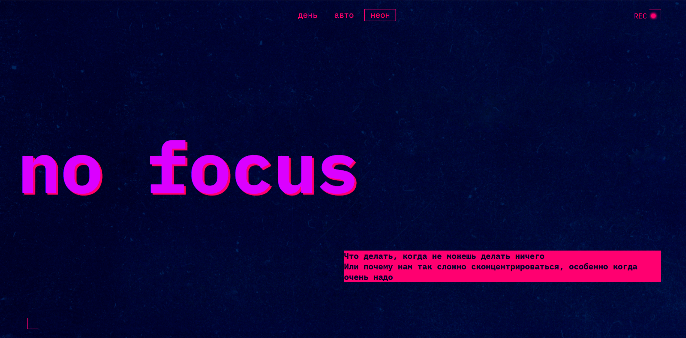

https://github.com/Murka69/slozhno-sosredotochitsya.git

# 🎯 Проектная работа «Сложно сосредоточиться»

## Описание

Проект представляет собой адаптивный сайт с поддержкой **светлой и тёмной тем оформления**, который становится более привлекательным и удобным благодаря **динамическим стилям и переключению темы оформления по нажатию кнопки**.

---

## 📌 Задача проекта

Задачей было сверстать современный, адаптивный сайт с двумя цветовыми схемами — светлой и тёмной — согласно макету в Figma.

---

## 💡 Использованные технологии

- **HTML5** – семантическая разметка страницы
- **CSS3** – каскадные таблицы стилей, медиазапросы, Flexbox, переменные CSS
- **JavaScript (vanilla)** – добавление интерактивности, реализация переключения тем

---

## 🎨 Функциональность

- **Переключение тем оформления**  
  Цветовая схема сайта меняется при нажатии на кнопку в шапке: пользователь может выбрать между светлой и тёмной темой.
- **Адаптивность**  
  Сайт корректно отображается на устройствах с различными разрешениями экрана: от мобильных телефонов до десктопов.

- **Динамические стили**  
  Темизация реализована через JavaScript и CSS-переменные, что делает смену темы плавной и эффективной.

---

🖼️ [Макет Figma](https://www.figma.com/design/d0Nf2YhJaRUt2sx5MLXRWM/-6-Сложно-сосредоточиться--Copy-?node-id=0-1&p=f&t=dKG0V6rRNY0CRUZR-0)

---

## 🛠 Как запустить локально

1. Склонируйте репозиторий:
   ```bash
   git clone https://github.com/ ваше-имя/slozhno-sosredotochitsya.git
   ```
2. Перейдите в папку проекта:
   ```bash
   cd slozhno-sosredotochitsya
   ```
3. Откройте файл ```index.html``` в браузере.

---
## Предварительный просмотр 
